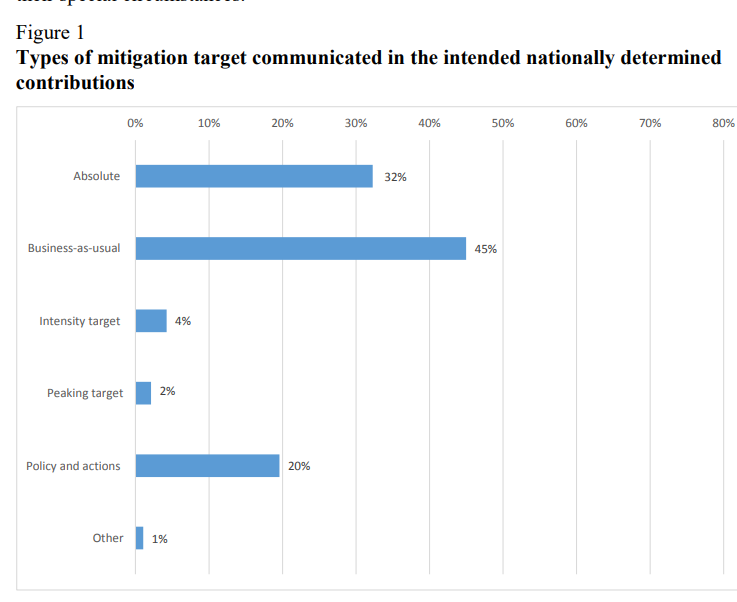

# Notes on the Paris agreement

The Paris agreement relies on individual country specific goals. As such the targets are not at all 
homogeneous. It can be expected that the impact of lockdown will not be homogeneous.

The goal is to get a broad idea of what the main types of goals
are and how they can be reduced to reasonable metrics.

## Sources

[Aggregate effect of the intended nationally determined contributions: an update](https://unfccc.int/resource/docs/2016/cop22/eng/02.pdf)
[Synthesis report on the aggregate effect of the intended nationally determined contributions](https://unfccc.int/resource/docs/2015/cop21/eng/07.pdf)

## Acronyms

+ INDC: intended nationally determined contributions
+ NDC: nationally determined contributions
+ GHG: green house gas
+ BAU: business as usual
+ GDP: gross domestic product
+ MIC: middle income country
+ GWP: global warming potential
+ LULUCF: land use, land-use change and forestry

## Exclusions from this report

+ Air traffic : 
+ MAritime transport : 

## Targets

### Types

+ absolute economy-wide mitigation targets: 
  + with absolute emission reduction targets expressed as an emission 
  reduction below the level in a specified
  base year, range: from 9.8 to 75.0 per cent;
  + or, overall maximum absolute limit.
+ relative reduction to BAU in 2030, eco-wide or industry specific. range [1 - 80.6] % 
+ Intensity targets: GHG emissions per unit of GDP or per capita, referenced 
to base year. range [10-45]%
+ Year of peak of emissions
+ Plans for developments for low GHG processes

+ Some sectoral and sub-sectoral goals
+ Conditions for full implementations of INDCs:
  + the level of effort undertaken by other Parties;
  + the availability of market-based mechanisms;
  + access to enhanced 
    + financial resources, 
    + technology transfer 
    + technical cooperation 
    + enhanced capacity-building support.

#### My thoughts  on target types

+ Expect short term improvements due to reduction in eco activity.
+ Huge drop in GDP, with lesser drop of emissions will actually mean
 getting further from targets for some countries.
+ Conditions for full implementation may be harder during 
and after lockdown and may be a set back.

### Year ranges

+ Reference year: main: 1990, 2005, others: 200-2014
+ Implementation years (from) : 2020, several <2020 few 2021
+ Implementation period: 5-10 years
+ Target years: 2030, 2025; few 2035, 2040, 2050

### Emissions

+ Many cover most or all of "the IPCC sectors" (*More info needed*):
  + specifically:  transport and buildings,
  + others: shipping and aviation, mining, oil industry flaring,
  solvents and electric power, tourism and water management
  + Many: land use, land-use change and forestry (LULUCF); BUT bad methodology so quantitative
  assessment challenging
+ Gases:
  + Most: carbon dioxide (CO2)
  + Many: methane (CH4) and nitrous oxide (N2O) 
  + Some: sulphur hexafluoride (SF6), hydrofluorocarbons (HFCs), perfluorocarbons
  (PFCs) and nitrogen trifluoride (NF3)
  + Few : short-lived climate forcers (SLCFs), black carbon or mononitrogen 
  oxides (NOX), non-methane volatile organic compounds (NMVOCs) and sulphur dioxide (SO2)

### Actions

+ Specific measures:
  + renewable energy targets
  + financial schemes to promote clean investment
  + environmental taxes
  + subsidy reforms 
  + fuel economy and energy conservation standards
  + grid modernization
  + programmes for low-emission agriculture and waste management
  + and measures to promote forest conservation and reduce deforestation.
+ market-based instruments from international, regional or domestic schemes

#### My thoughts on actions

+ Some actions are likely to be helped by the recession (targeted gov investment) 
and others set back (taxes, investments).
+ Lost mind share for climate change may make international measures and rule making slower.

### Politics

+ Buy-in from local stakeholders
+ "All Parties included a narrative on how they consider their INDCs to be fair and
ambitious" 
+ "Many Parties provided information on their support needs, highlighting the
need for enhanced international support for the implementation of their INDCs"

#### My thoughts

+ Very significant risk of agreement breakdown as parties expressly look at each other
and may start to play the 0 sum game. Quantify risk? Establish scenarios?

