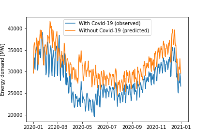

# An Extensible Software Framework for Investigating the Impact of Covid-19 on the UK 
This document summarises BristolFluFighters’ submission for the NERC COVID-19 Digital Sprint Hackathon 2 (June 15 09:00 to June 19 23:59).

## Key Findings
* The UK-wide energy consumption during lockdown has dropped by 12%, yielding a decrease in CO2 emissions related to power-generation of **20%**
* The energy demand decrease is correlated to the Google mobility with a Pearson coefficient of 0.57.
* NO2 levels across 5 cities (London, Birmingham, Bristol, Manchester, Liverpool) has shown a steady decrease since lockdown began. However without a larger sample size it is not possible to say whether this is due to the lockdown or seasonal effects.

The rest of this document provides a summary of the main elements of our submission, with further details available from the Jupyter Notebooks and Markdown files linked in each section.

## Problem Statement
Here we break down the [Hackathon problem statement](https://digitalenvironment.org/home/covid-19-digital-sprint-hackathons/covid-19-hackathon-2-recovery/) into specified and implied tasks:

*What are the positive and negative aspects of lockdown and recovery measures on meeting Paris and net zero targets?*
* **Specified** - Quantify how the UK’s emissions have been affected by the lockdown measures and investigate how they will change as lockdown is lifted
* **Implied** - We must understand the metrics used to measure GHG emissions, specifically CO2, and find data sources which provide this information for historic and recent (since Jan 20) timescales.

*Using multivariate signals to highlight these impacts and their inter-relationships to inform decision making.*
* **Specified** - Use data to quantitatively measure the impact of lockdown and examine the relationships between different data sources.
* **Implied** - Use data modelling techniques to identify trends and make predictions for our chosen dataset.

## Objectives
Here we detail the objectives we set for ourselves during the Hackathon:
* Quantify the impact of COVID-19 on UK emissions
* Develop an extensible framework for calculating correlations between signals and predicting future trends.
* Examine relationships between different datasets to identify the drivers for any observed changes in emissions.

## Challenges
Here we detail the key challenges and how we have mitigated against them:
* **Challenge** - Real-time CO2 emissions data is not available. Earth Orbit platforms are attempting to deliver this capability but a solution is not currently in place that provides open-access data up to the present day.
* **Mitigation** - Derive relationships between metrics available in real-time (e.g. power, mobility, GDP) and historical human GHG emissions, use this to predict lockdown emissions.
* **Challenge** - Real-time data sources are available ([see below](:Data Source Considered) ) however many of them only contain data since Jan 2020, this makes identifying seasonal trends difficult.
* **Mitigation** - Use real-time data sources to predict annual trends that can be compared with historical records which are typically logged on an annual basis.
* **Challenge** - Once a relationship is established, the change in the real-time metric due to COVID-19 must be estimated. We need to know its current value and an estimate of what that value would have been without any changes in behaviour. 
* **Mitigation** - Our proposed framework estimates what the signal would have been without the pandemic whilst accounting for any seasonal (annual) variation that is present.

## Proposed Solution
Our proposal is to develop an extensible software framework that can investigate the relationships between multiple time-varying signals. 

We will use this framework to investigate how human activity has changed during lockdown and make predictions of how the UK’s emissions have changed as a result of the observed trends. 

This approach is advantageous as it will allow new datasets to be considered as they become available, this provides a level of future-proofing and ensures our solution can provide benefit beyond the scope of this hackathon.

## Data sources considered

In order to address the challenges identified above, large amounts of varied data are required. Since the real time GHG emission data could not be procured the following proxies were gathered:

1. Historical greenhouse gas emission data (from [climatewatchdata](https://www.climatewatchdata.org));
2. Air quality indicators (from the [UK MET Office](https://metdatasa.blob.core.windows.net/covid19-response/index.html));
3. Personal mobility information (from [Google](https://www.gstatic.com/covid19/mobility), [Apple](https://www.apple.com/covid19/mobility) and [CityMapper](https://cdn.citymapper.com/data/cmi));
4. Electricity production and consumption (from [Gridwatch](https://www.gritwatch.templar.co.uk));
5. Employment data (from the [ONS](https://www.ons.gov.uk/employmentandlabourmarket/peopleinwork/employmentandemployeetypes/articles/furloughingofworkersacrossukbusinesses/23march2020to5april2020)).

These datasets have widely varying spatio-temporal features:

- They can be local, regional and global;
- They vary from yearly frequency since 1850, through daily updates since the 12th of February 2020, to 5mn intervals since 2011.

Consequently the information provided and their use within our solution needs to be adjusted in function of those features:

- Mobility and economic indicators provide a very detailed account of the change in behaviour during lockdown;
- Air quality indicators and power generation provide causal relationships to emissions;  
- And finally historical breakdowns of GHG emissions permit to relate these changes to their potential impact on the Paris Agreement and Net-Zero goals.

## Solutions Developed

The following tools were developed and are provided in notebooks and the `brsflufigh_nerc2` python package:

- A Holt-Winter’s Seasonal Smoothing model to predict evolution of metrics in 2020 with and without lockdowns [`energy_forecast` notebook](energy_forecast.ipynb).
- A lightweight data management framework enabling the exploration of the heterogeneous datasets 
([provided by `data_access.py`](brsflufight_nerc2/data_access.py)).
- Correlation tool to establish relationships between those datasets ([provided by `model_predict.py`](brsflufight_nerc2/model_predict.py)).
- Prediction tool based on the calculated correlations ([Example usage in `minimal-correlation-example` notebook](minimal-correlation-example.ipynb)).

To supply these tools the following datasets were accessed and prepared:

  - 3 sources of mobility data during lockdown (daily, ~180 countries);
  - 3 sources of historical GHG emissions by sector and by country (yearly, ~200 countries);
  - 3 different [real-time air-quality metrics](data/atmos_nrt_plot_data.ipynb) (hourly, local UK level);
  - Real-time power generation data (sub-hourly, UK wide level)[real_time energy demand and generation](data/energy_data_processing.ipynb);
- UK furlough rates [uk_furlough_rates](data/furlough_rates_UK.ipynb)
  - Estimates of lockdown impact from ([Quéré et al. 2020](https://www.nature.com/articles/s41558-020-0797-x)).

All notebooks used in the preparation of this data are available in the [`data/`](data/) directory.

## Dataset visualisation

In order to assess the usefulness of different datasets visualisation were generated. A complete set of figures is presented in the [`data_viz` notebook](data_viz.ipynb).

### Mobility data

Mobility data provided by smartphone manufacturers show the change in journeys taken by smartphone owners during the lockdown.

On this dataset the impact of lockdown appears extremely clearly.

### Historical greenhouse gas emissions

GHG emissions are collected and reported by a large number of organisations. This data can be [downloaded](https://www.climatewatchdata.org/data-explorer/historical-emissions?historical-emissions-data-sources=All%20Selected&historical-emissions-gases=&historical-emissions-regions=&historical-emissions-sectors=&page=1&sort_col=country&sort_dir=ASC) from “climatewatchdata”.

This shows the long term evolution and emissions for 4 of the 200 countries available.

### Real-time power grid information

[Gridwatch](https://www.gridwatch.templar.co.uk/download.php) provides high-frequency power production and demand information for the UK.

This visualisation of the energy demand clearly shows seasonality which must be taken into account when extracting the impact of COVID on these metrics.

## Time forecasting to quantify changes in key metrics

To understand the impact of Covid-19 induced changes in behaviour need to be quantified. To do this we need to calculate the difference between the values including the effects of the pandemic and the values if there had been no pandemic. To calculate the values without the influence or the pandemic, a model based on data from before the pandemic is used to predict what the values would have been if those trends had continued. A similar based that is based on data that includes the pandemic can be used to predict what the future values will be based on the annual historical variations and the changes in the value that have already been observed due to the pandemic. These models work because it is possible to split the original data into a long term trend, a repeatable annual variation and remaining residuals. Below is an example of the decomposed signal and the predictions/observations for energy demand in 2020 with and without the impact of the pandemic.

The difference between the demand with and without the pandemic can be used to quantify the reduction in this metric across the year. For more detail on this model visit the [`energy_forecast` explanation](data/energy_forecast.md) and/or the [`energy_forecast` notebook](energy_forecast.ipynb) .

## Estimating GHG reduction due to reduced energy demand
This repository implements an extensible multivariate correlation framework. In order to test the change in $CO_2$ emissions due to the COVID-19 lockdown for the energy sector in the UK is predicted in the [`correlate` notebook](correlate.ipynb). 
The correlation framework follows 4 steps:

+ Data preparation (extraction and combination) of the daily energy data from gridwatch;
+ Correlation to GHG emissions of the UK Energy industry in the years 2013-2017.
+ Prediction of the expected change in energy demand due to lockdown.
+ Model the change emissions with a linear regression to the change in demand of the power generation sector.

**Key findings:**
A saving between 43 and 77 MtCO2e of emissions for the UK in 2020. The 43 MtCO2e saving is calculated with an instant recovery of energy demand on the 1st of July while the 77 MtCO2e assume no recovery beyond seasonality.

## Future work
* Include additional data sources such as:
  + Weather data - To account for variations due to weather
  + Economic data - Such as GDP and stock market to account for economic impacts
  + Lockdown data - Identify a Confinement Index for quantifying the severity of lockdown measure and add this to our correlation.

* Examine local variations across several geographic regions. Currently the datasets are UK-wide (with the exception of air-quality) however as the government seeks to move out of lockdown it is possible that local restrictions on freedom of movement may need to be implemented. A framework, such as the one proposed here, which is capable of analysing datasets of arbitrary timeseries data is ideally placed to provide predictions on a local scale.

* Code improvements, such as automating the data pipeline and hyper-parameter optimisation for the time forecasting model to reduce user workload.
